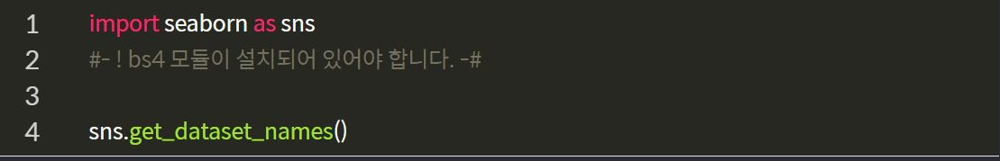
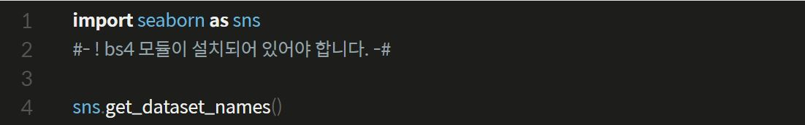
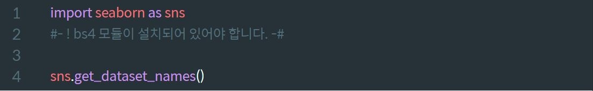
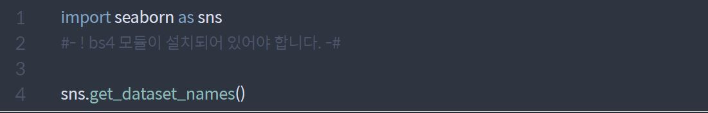
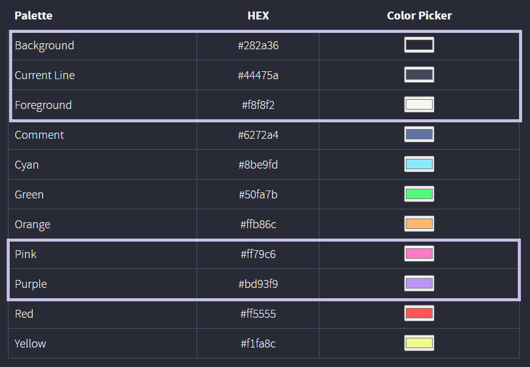

# LmsDraculaTheme Extension

대꾸를 위한 LMS 어두운 테마!  
[설치링크](https://chrome.google.com/webstore/detail/lms-themechanger/lmloiopjeaodjnaojfknfmlbhmbfojml?hl=ko&authuser=0)

## Dracula Theme

- 문제: `화이트 테마`로 인해 눈이 아프다는 컴플레인

- 해결: `다크 테마`를 적용해보자

- 조건

  - 추측이지만 `es6`문법을 적용하기 위해 사용된 `babel`에 `remove-console`이 적용되어 `Dev-tools` 결과를 보기 힘듬.

  - 직접 소스 코드의 `styled-components`의 `createGlobalStyle`을 조작해 바꿀수 없음

  - 특정 컴포넌트들이 1초 간격으로 `state`의 재랜더링 되고, console의 에러문이 많이 나와 눈이 아프다!(으악!)

- 결론

  - Extension을 제작하여 해당 컴포넌트의 tab을 주시하게 만들까 고려 했으나 `chrome`의 `js 엔진`이 아닐 경우 브라우저별로 만들어야한다

  - 그렇기 때문에 `DOM`을 이용하여 `css`의 요소를 바꿔야하며, 페이지가 바뀌어도 다시 적용될수 있도록 반복 해야한다.

## chrome - extension

- extension을 통해 `원하는 컬러 테마`를 설정 할수 있도록 변경

- chrome extension v3 환경에 맞도록 제작

## 사용법

# 중요! 
- 해당 확장자는 `lms`의 `node`안에 들어가서 변경을 해야 설정이 됩니다! 

- `color`

  - 원하는 색상 조정

- `code theme`

  - 원하는 코드 테마 선택

- `Apply`

  - toggle 버튼을 통해 선택한 세팅 적용

## 기본테마

- 기본테마는 `'#283a36', '#44475a', '#f8f8f2', '#ff79c6', '#bd93f9', 'monokai'`로 `dracula` `monokai`테마와 테마를 사용

- 코드 테마는 여러가지의 선택지가 있었지만, 필자가 좋아하는 테마로 구성하여

  - `monokai`
    

  - `icecoder`
    

  - `dracula`
    

  - `material`
    

  - `nord`
    

- LMS 다크 테마 색상표 (공식 Dracula theme의 컬러를 사용하였습니다)
  
